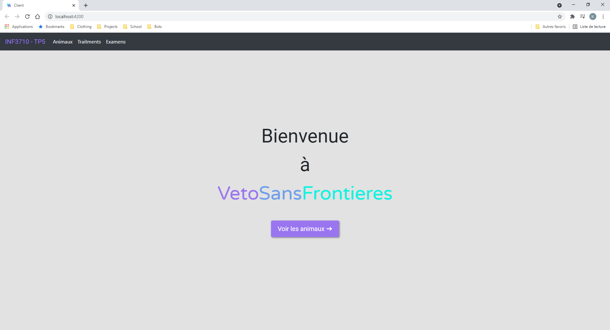
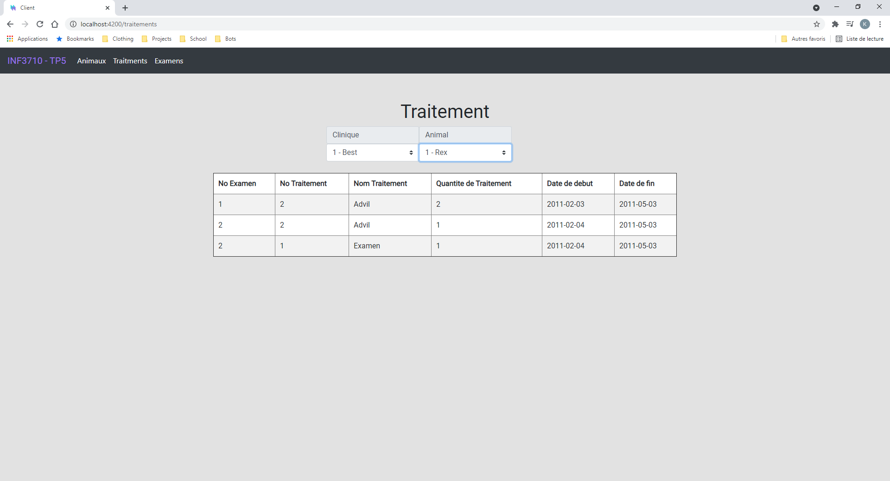
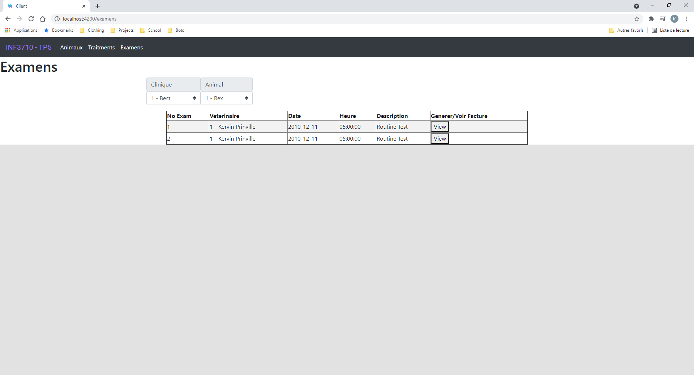
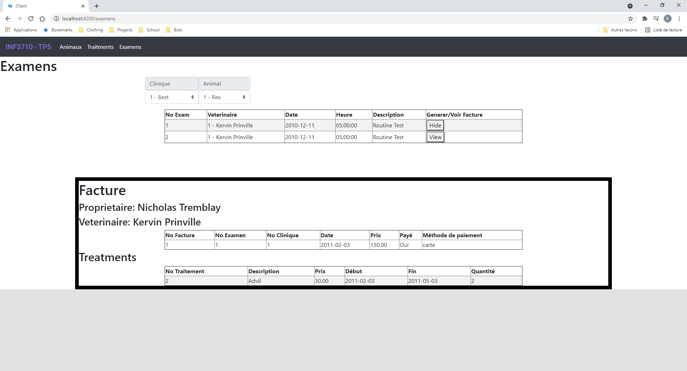
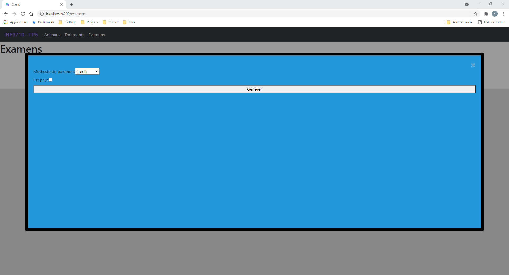

# INF3710_TutorielApp

INF3710

## Avant de lancer le projet
- Assurez-vous que Postgres roule sur vos machines 

- Vérifiez que vous avez NodeJs installé avec `node –v` en ligne de commande, si vous ne l'avez pas fait, veuillez suivre les étapes dans les dispos du labo

- Allez dans `/client`  et lancez `npm install` en ligne de commande

- Allez dans `/server` et lancez `npm install​` en ligne de commande

- Si vous êtes sur Windows, executez JSONReader.exe et remplissez les informations de la DB afin de générer le fichier d'informations.

- Sinon, entrez manuellement les informations dans le ficher information.json

## Pour lancer le projet

- Allez dans `/server` et faites `npm start` en ligne de commande​

- Allez dans `/client` et faites `npm start` en ligne de commande​

## Screenshots

